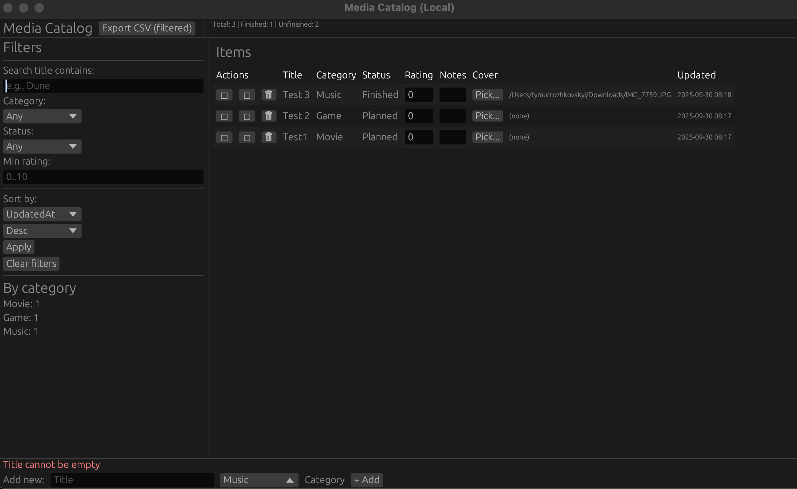

# Rust Media Catalog

A **local-only media cataloging app** written in Rust.  
Tracks books, movies, games, music, and more with **search, filtering, sorting, statistics, and CSV export**.  
All records are stored **locally in SQLite**, so no internet or accounts are required.

---

## Features
- Add / view / edit / delete media items
- Fields: **Title, Category, Status, Rating, Notes, Cover image path**
- Persistent storage in `media_catalog.sqlite`
- Search and filter by title, category, status, and rating
- Sorting by multiple fields (title, category, status, rating, created/updated date)
- Toggle “mark as watched/read/finished”
- Export filtered list to CSV (`export_YYYYMMDD_HHMMSS.csv`)
- Optional cover image (file path stored, file chooser integrated)
- Statistics:
  - Total items
  - Finished vs. unfinished
  - Counts per category
- Error handling and validation
- GUI built with **egui/eframe**

---

## Getting Started

### 1. Clone and build
```bash
git clone https://github.com/m1rageLA/Media-Library-Tracker
cd [prj name]
cargo run
```

The first run will create a local SQLite database file:  
**`media_catalog.sqlite`**

---

## Usage

### Main window
- **Top panel**: app title, “Export CSV” button, statistics (total, finished, unfinished)
- **Left panel (Filters)**: search, filter by category/status, min rating, sort options
- **Central panel**: table of items with actions
- **Bottom panel**: add new item form and error messages

---

## Screenshot



---

### Adding items
1. Enter a title in the bottom `Title` field.
2. Select a category (Book, Movie, Game, Music, Other).
3. Press **+ Add**.  
   The new item appears in the table.

---

Inline editing is supported:
- Rating (0–10)
- Notes
- Cover image path (via **Pick…** button)

All changes are immediately saved to the database.

---

### Filtering and sorting
Left panel:
- Search by title substring
- Filter by category / status
- Minimum rating filter
- Sort by field (title, category, status, rating, created_at, updated_at) and order (asc/desc)

Buttons:
- **Apply** – apply filters and refresh results
- **Clear filters** – reset all filters

---

### Export to CSV
- Click **Export CSV (filtered)** in the top panel.
- Creates a file:  
  **`export_YYYYMMDD_HHMMSS.csv`** in the current directory.
- Only currently filtered results are exported.
